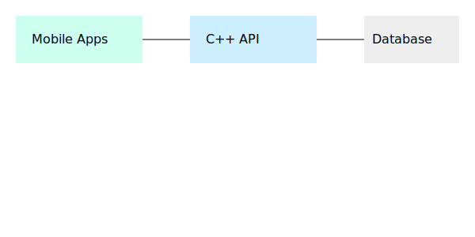
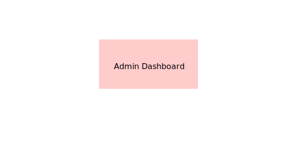

# People Helping People Texas – System Architecture

## Overview
This document describes the architecture, data model, and safety controls used in the People Helping People Texas application. It is designed for **app store review**, **academic evaluation**, and **security audits**.

---

## System Architecture

**Description**
- Mobile clients (iOS, Android, Web) communicate with a C++ REST API (Crow) over HTTPS
- The API handles verification, abuse detection, and notifications
- Sensitive data is stored in SQLite/PostgreSQL with encrypted storage
- ID images are stored separately and deleted after the retention period

---

## Verification Workflow

**Safety Design Notes (App Store Relevant)**
- Identity verification is **human‑reviewed**, not automated
- Users must explicitly consent before uploading ID
- Verification images are never shared with helpers

---

## Admin Dashboard

Admins:
- Authenticate using JWT
- Review pending verifications
- Approve or reject requests
- Cannot export or reuse ID images

---

## Database ERD

### Data Retention & Encryption
- ID images: encrypted at rest, deleted after 30–90 days
- Personal data: stored minimally, never sold or shared
- Verification result retained as a boolean flag only

This approach complies with the Texas Data Privacy and Security Act (TDPSA).

---

## Abuse Detection

Text content is scanned server‑side for threats or harassment before publication.
Flagged content is escalated for manual review.

---

## App Store / Play Store Compliance Notes
- Sensitive data usage is clearly disclosed
- Manual review prevents automated decision‑making
- Users can request data deletion at any time
- Privacy Policy required before launch
